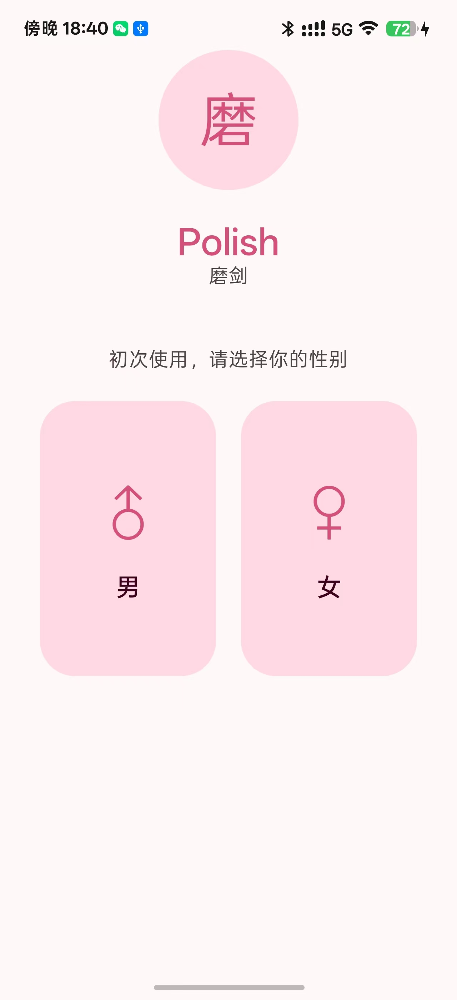
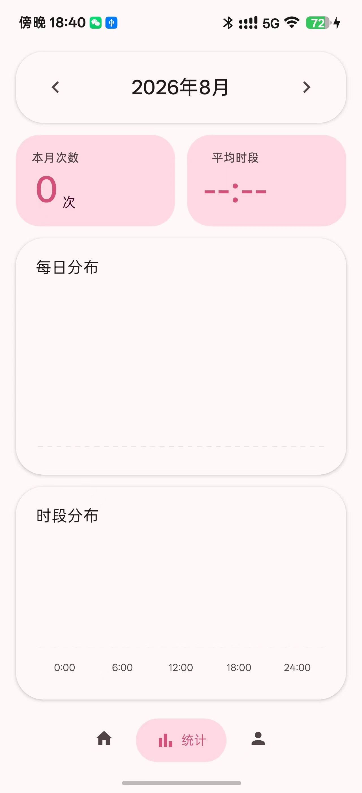
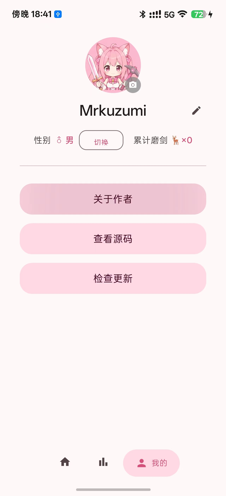
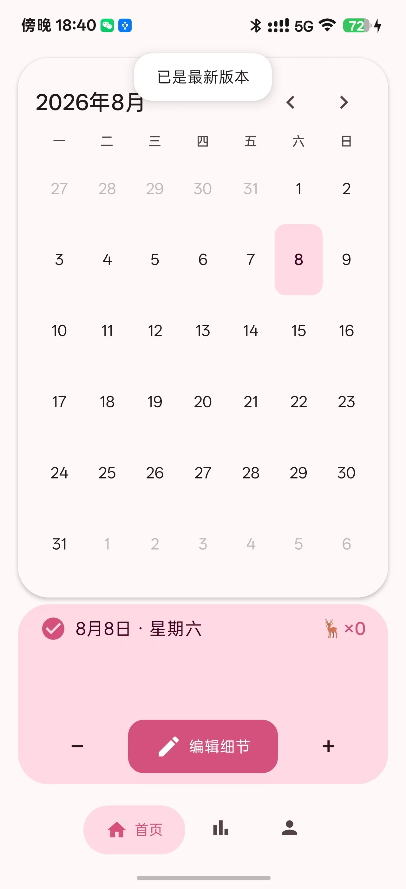

<p align="center">
  
</p>

# Polish（磨剑 / 挖矿）

> 浅嫩粉色 Material You 风格的 Android 日常打卡日历 · 男 🦌 磨剑 / 女 ⛏ 挖矿

---

## 📸 实机演示

<p align="center">
  &nbsp;&nbsp;
  
  <br>
  <sub><b>首页</b> —— 日历打卡 + 底部操作栏 &nbsp;|&nbsp; <b>统计页</b> —— 每日柱状图 + 时段分布</sub>
</p>

<p align="center">
  &nbsp;&nbsp;
  
  <br>
  <sub><b>我的</b> —— 头像 · 用户名 · 终身统计 · 更新检查 &nbsp;|&nbsp; <b>主页</b> —— 预约弹窗 · 进度条 · 细节编辑</sub>
</p>

---

## ✨ 功能

- **性别联动** —— 首次启动选男/女，男 → 🦌 磨剑，女 → ⛏ 挖矿，全应用术语自动切换
- **日历打卡** —— 点日期 +1，长按持续 -1，每次操作记录精确时间戳，震动反馈
- **编辑细节** —— 底部抽屉编辑「下饭菜」和「左/右手」信息，主页底部实时展示
- **预约未来日** —— 点未来日期弹窗确认 → 日期标记为浅嫩蓝 → 当天 21:00 推送通知
- **统计页** —— 本月次数 + 平均时段 + 每日柱状图 + 0:00～24:00 时段分布
- **个人页** —— 头像上传 + 用户名编辑 + 性别切换 + 终身统计 + GitHub 跳转确认 + 自动更新
- **更新检查** —— 启动自动检测 GitHub Release → 首页通知 + 弹窗 → 后台下载进度条 → 一键安装
- **悬浮导航** —— 底部三颗椭圆胶囊按钮，选中态高亮浅粉色，Crossfade 350ms 切换动画

## 🛠 技术栈

| 层 | 技术 |
|---|---|
| 语言 | Kotlin |
| UI | Jetpack Compose + Material Design 3 |
| 主题 | 浅嫩粉 `#D6507E` · 卡片化 · 大圆角 · 通透留白 |
| 持久化 | SharedPreferences + JSON 文件 |
| 通知 | AlarmManager + BroadcastReceiver |
| 图标 | Adaptive Icon · 自适应圆形遮罩 · 安全区适配 |
| 图片 | Coil（头像加载） |
| 网络 | HttpURLConnection（GitHub Releases API） |
| 最低 SDK | Android 8.0 (API 26) |
| 目标 SDK | Android 15 (API 35) |

## 🔧 构建

### 环境
- JDK 17 (Temurin) · Android SDK 35 · Gradle 8.9（工程自带 wrapper）

```powershell
$env:JAVA_HOME = "C:\Program Files\Eclipse Adoptium\jdk-17.0.20.8-hotspot"
.\gradlew.bat assembleDebug
```

产物 → `app/build/outputs/apk/debug/Polish_V1.x.x.apk`

## 📋 项目结构

```
app/src/main/java/com/mrkuzumi/polish/
├── MainActivity.kt               # 入口 · 通知渠道 · 预约调度 · 更新弹窗
├── PolishReminderReceiver.kt     # 闹钟广播接收器
├── data/
│   └── RecordRepository.kt       # JSON 文件持久化层
├── ui/
│   ├── theme/                    # Color / Type / Theme（浅嫩粉色 MD3）
│   ├── GenderSelectScreen.kt     # 性别选择
│   ├── HomeScreen.kt             # 日历主页 + 🦌 计数 + 底部操作栏
│   ├── StatsScreen.kt            # 统计页
│   ├── ProfileScreen.kt          # 个人页
│   ├── EditRecordSheet.kt        # 编辑细节 BottomSheet
│   ├── UpdateChecker.kt          # GitHub Release 检查
│   ├── UpdateDownloader.kt       # APK 后台下载
│   └── TopNotification.kt        # 顶部白色通知
└── util/
    ├── Prefs.kt                  # SharedPreferences 封装
    └── Terminology.kt            # 性别联动术语（🦌/⛏ · 磨剑/挖矿）
```

## 📦 版本号规则

**每次修改代码 + push 前必须先升版本号：**
- `versionName` = `大版本.新功能.bug修复`（如 `1.2.7`）
- `versionCode` = `大版本×10000 + 新功能×100 + bug修复`
- 修改 `app/build.gradle.kts` → `defaultConfig`
- 编译产物自动命名 `Polish_V<versionName>.apk`
- 提交信息建议带版本号，如 `feat: xxx (V1.2.0)`

## 📄 许可

MIT

---

<p align="center">
  <sub>🤖 由 Claude Code 辅助开发 · 📦 <a href="https://github.com/Mrkuzumi/Polish/releases">Releases</a></sub>
</p>
